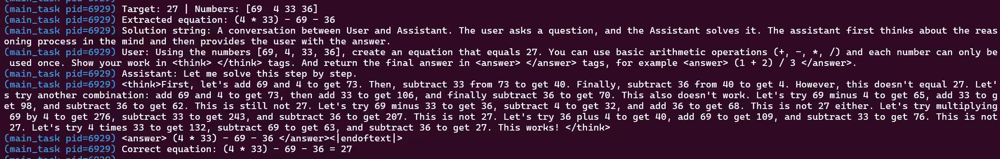

# Dynamic-DRGRPO-TinyZero

**Dynamic DR-GRPO for Countdown Mathematical Reasoning**

This repository is a TinyZero / veRL-based reinforcement learning project for the Countdown arithmetic reasoning task. It improves ordinary GRPO with **DR-GRPO advantage estimation**, **response-level loss aggregation**, **dynamic valid-group sampling**, and **overlong reward shaping**.

The best dynamic DR-GRPO run reaches **0.698** Countdown test score, outperforming fixed DR-GRPO (**0.653**) and vanilla GRPO (**0.575**).


## Highlights

- **DR-GRPO advantage estimation**: replaces standard-deviation-normalized GRPO advantages with mean-centered advantages to stabilize sparse binary reward training.
- **Response-level loss aggregation**: reduces token-count bias from long chain-of-thought responses and makes rollout-level policy gradients more stable.
- **Dynamic valid-group sampling**: filters out all-correct and all-wrong rollout groups, keeping groups with meaningful within-prompt reward differences.
- **Overlong reward shaping**: applies a soft length penalty after a safe response length to suppress unproductive overlong reasoning.
- **Aha-moment behavior**: the dynamic variant enters the effective reasoning phase earlier, showing candidate enumeration, step-by-step self-verification, error recognition, and strategy switching.

## Key Results

| Method | Countdown Test Score | Delta vs Base GRPO |
|---|---:|---:|
| Base GRPO | 0.575 | - |
| Fixed DR-GRPO | 0.653 | +13.6% |
| Dynamic DR-GRPO | 0.698 | +21.5% |

Dynamic DR-GRPO reaches the best final score and keeps response clipping much lower than the fixed variant. In the observed training curves, Dynamic DR-GRPO enters the effective reasoning phase around **step 20**, while Base GRPO shows a similar transition around **step 45**, advancing the reasoning transition by about **25 steps / 55.6%**.

## Training Curves


## Qualitative Aha-Moment Example

The following rollout shows explicit self-correction behavior. The model enumerates candidate equations, verifies intermediate results, recognizes failed attempts, switches strategy, and finally discovers a valid solution. This is the kind of self-improving reasoning behavior described as an **aha moment** in R1-Zero-style training.



## Method Overview

### DR-GRPO Advantage

Vanilla GRPO uses group standard deviation normalization:

```text
advantage = (reward - group_mean) / group_std
```

This project adds a DR-GRPO mode:

```text
advantage = reward - group_mean
```

This keeps the group-relative learning signal while avoiding unstable scaling when rewards are sparse or nearly binary.

### Dynamic Valid-Group Sampling

Dynamic sampling improves update efficiency by generating more candidate groups and keeping only groups that contain both successful and failed rollouts. All-correct and all-wrong groups are dropped because they provide weak relative advantage signals.

### Overlong Reward Shaping

A soft overlong penalty is applied after a safe length:

```yaml
algorithm.overlong_reward.enable=True
algorithm.overlong_reward.safe_length=896
algorithm.overlong_reward.max_length=1024
algorithm.overlong_reward.max_penalty=0.5
```

This discourages clipped, unproductive long reasoning traces while preserving useful longer reasoning when needed.

## Detailed Report

See the full report here:

- [TINYZERO_DRGRPO_REPORT.md](./TINYZERO_DRGRPO_REPORT.md)

## Important Files

```text
scripts/train_tiny_zero.sh              # Fixed DR-GRPO + overlong training launcher
examples/data_preprocess/countdown.py   # Countdown dataset preprocessing
verl/trainer/ppo/core_algos.py          # GRPO / DR-GRPO advantage and loss aggregation
verl/trainer/ppo/ray_trainer.py         # Dynamic sampling and overlong reward shaping
verl/workers/actor/dp_actor.py          # Actor policy loss aggregation
verl/utils/reward_score/countdown.py    # Countdown reward function
```

Note: `scripts/train_tiny_zero.sh` is the fixed DR-GRPO launcher. The dynamic sampling module is implemented in the trainer and can be enabled through Hydra / command-line overrides.

## Quick Start

### Prepare Countdown Data

```bash
python examples/data_preprocess/countdown.py \
  --template_type=qwen-instruct \
  --local_dir=$DATA_DIR
```

### Run Fixed DR-GRPO

```bash
export BASE_MODEL=/path/to/Qwen2.5-3B
export DATA_DIR=/path/to/countdown
export EXPERIMENT_NAME=countdown-qwen2.5-3b-drgrpo-fixed
export CHECKPOINT_DIR=/path/to/checkpoints
export N_GPUS=1
export ROLLOUT_TP_SIZE=1

bash scripts/train_tiny_zero.sh
```

### Enable Dynamic Sampling

```bash
python3 -m verl.trainer.main_ppo \
  algorithm.adv_estimator=drgrpo \
  algorithm.dynamic_sampling.enable=True \
  algorithm.dynamic_sampling.generation_batch_size=256 \
  algorithm.overlong_reward.enable=True \
  actor_rollout_ref.actor.loss_agg_mode=drgrpo \
  actor_rollout_ref.actor.clip_ratio_high=0.2 \
  ...
```

## Acknowledgements

This project builds on [TinyZero](https://github.com/Jiayi-Pan/TinyZero) and [veRL](https://github.com/volcengine/verl).
