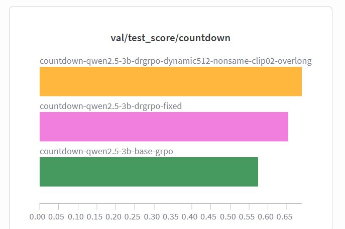
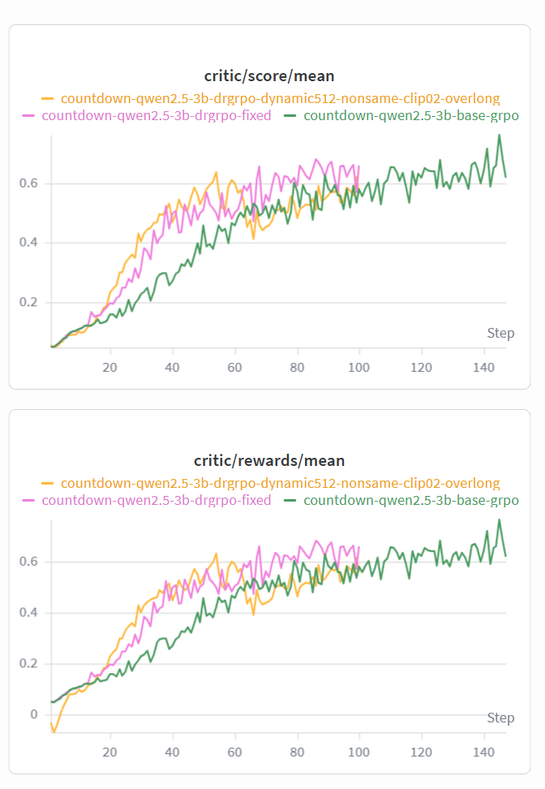
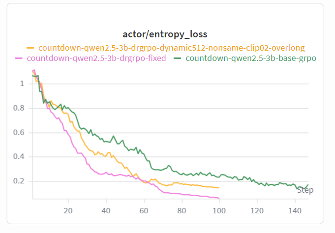
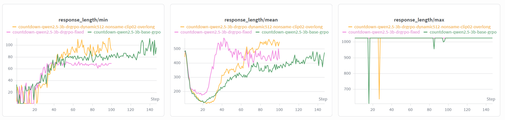

# TinyZero-DRGRPO

Python 3.10+ / PyTorch / veRL / TinyZero / Qwen2.5-3B

## Stabilizing GRPO Training for Countdown Mathematical Reasoning

This project improves GRPO training on the Countdown arithmetic reasoning task by modifying the TinyZero / veRL training stack. The core design combines **DR-GRPO advantage estimation**, **response-level loss aggregation**, **dynamic valid-group sampling**, and **overlong reward shaping** to address sparse reward, invalid group updates, and long-response instability in ordinary GRPO.

The best dynamic DR-GRPO variant reaches **0.698** Countdown test score, outperforming fixed DR-GRPO (**0.653**) and vanilla GRPO (**0.575**).

## Key Results

| Method | Countdown Test Score | Delta vs Base GRPO |
|---|---:|---:|
| Base GRPO | 0.575 | - |
| Fixed DR-GRPO | 0.653 | +13.6% |
| Dynamic DR-GRPO | 0.698 | +21.5% |

Dynamic DR-GRPO achieves the best final score while maintaining a much lower response clipping ratio than the fixed variant. From the training curves, the dynamic variant enters the effective reasoning phase around **step 20**, while Base GRPO shows a similar transition around **step 45**, advancing the reasoning "aha-moment" by roughly **25 steps / 55.6%**.



## Problem & Motivation

Standard GRPO is not ideal for Countdown-style mathematical reasoning because the reward is sparse, group-level signal can degenerate, and long chain-of-thought responses can dominate token-level optimization.

We identify three main failure modes.

### 1. All-Correct / All-Wrong Group Degeneration

GRPO relies on relative advantages inside a sampled group. If all responses for the same prompt are correct or all responses are wrong, the group provides little useful preference signal. This makes policy updates inefficient because the model cannot learn which rollout is better within the group.

### 2. Length-Induced Gradient Bias

Ordinary token-level loss aggregation makes longer responses contribute more tokens to the policy loss. In reasoning tasks, this can over-emphasize verbose but unproductive chain-of-thought traces and make the training signal less aligned with final correctness.

### 3. Overlong Response Clipping

The model can generate unnecessarily long reasoning traces that hit the maximum response length. Once a response is clipped, useful answer supervision can be lost and the training dynamics become unstable.

The goal of this project is to make GRPO learn more from valid within-group differences while suppressing unproductive overlong reasoning.

## Method

### 1. DR-GRPO Advantage Estimation

Vanilla GRPO computes group-relative advantage with standard deviation normalization:

```text
advantage = (reward - group_mean) / group_std
```

DR-GRPO removes the fragile standard deviation term and uses mean-centered reward:

```text
advantage = reward - group_mean
```

This keeps the group-relative learning signal while avoiding unstable scaling when rewards are sparse or nearly binary.

Implementation:

```text
verl/trainer/ppo/ray_trainer.py
verl/trainer/ppo/core_algos.py
```

The behavior is controlled through:

```text
algorithm.adv_estimator=drgrpo
normalize_by_std = adv_estimator == "grpo"
```

### 2. Response-Level Loss Aggregation

The project adds a DR-GRPO loss aggregation mode to reduce token-count bias from long responses:

```text
actor_rollout_ref.actor.loss_agg_mode=drgrpo
```

Instead of globally averaging loss over all valid response tokens, DR-GRPO aggregation normalizes each response by a fixed response-length normalizer before averaging across samples. This makes rollout-level policy gradients more stable and prevents long responses from dominating the update.

Implementation:

```text
verl/trainer/ppo/core_algos.py
verl/workers/actor/dp_actor.py
```

### 3. Dynamic Valid-Group Sampling

The trainer implements dynamic sampling to avoid wasting updates on all-correct or all-wrong groups.

Mechanism:

1. Generate more candidate prompt groups than the target training batch.
2. Compute rewards for all rollouts.
3. Keep only prompt groups whose rollout rewards contain both successful and failed samples.
4. Drop all-correct and all-wrong groups because they provide weak relative advantage signal.
5. Train PPO only on valid groups.

This increases the density of useful preference signals in each policy update.

Implementation:

```text
verl/trainer/ppo/ray_trainer.py
```

Logged metrics:

```text
dynamic_sampling/generated_groups
dynamic_sampling/valid_groups
dynamic_sampling/selected_groups
dynamic_sampling/keep_ratio
dynamic_sampling/all_correct_groups
dynamic_sampling/all_incorrect_groups
dynamic_sampling/dropped_remainder_groups
```

Note: the committed `scripts/train_tiny_zero.sh` uses fixed DR-GRPO and sets `algorithm.dynamic_sampling.enable=False`. The dynamic DR-GRPO experiment corresponds to enabling the implemented dynamic sampling module through command-line or Hydra overrides.

### 4. Overlong Reward Shaping

The project introduces a soft penalty for responses exceeding a safe length:

```yaml
algorithm.overlong_reward.enable=True
algorithm.overlong_reward.safe_length=896
algorithm.overlong_reward.max_length=1024
algorithm.overlong_reward.max_penalty=0.5
```

Penalty form:

```text
penalty = -max_penalty * (response_length - safe_length) / (max_length - safe_length)
```

The penalty is added to the final valid response token. This discourages long but unproductive reasoning while still allowing longer traces when they are useful.

Implementation:

```text
verl/trainer/ppo/ray_trainer.py
```

Logged metrics:

```text
overlong/penalty_mean
overlong/penalty_min
overlong/affected_ratio
overlong/at_max_ratio
response_length/clip_ratio
```

## Training Dynamics

The training curves show a clear transition in behavior.







- Base GRPO improves more slowly and tends to keep longer, less controlled responses.
- Fixed DR-GRPO improves faster, but response clipping can spike; in the observed run, the clipping ratio peaks around **0.31**.
- Dynamic DR-GRPO keeps clipping much lower, around **0.03**, while reaching the best final test score.

Interpretation:

1. Early training: the model abandons unproductive long chain-of-thought and response length drops sharply.
2. Middle training: useful arithmetic search behavior emerges and score/reward rises quickly.
3. Later training: response length increases moderately as the model learns useful search rather than verbose wandering.

This explains why dynamic DR-GRPO shows an earlier reasoning "aha-moment" than Base GRPO.

## Technical Highlights

### 1. GRPO Signal Stabilization

DR-GRPO removes unstable standard-deviation normalization and uses response-level loss aggregation to make sparse binary reward training more stable.

### 2. Valid-Group Sampling

Dynamic sampling filters out low-information all-correct and all-wrong groups, increasing the proportion of updates with meaningful within-group preference signals.

### 3. Length-Aware Reward Shaping

Overlong reward shaping suppresses clipped, unproductive responses while preserving longer reasoning when it improves final correctness.

### 4. Full veRL/TinyZero Integration

The method is implemented inside the veRL PPO trainer, actor loss, configuration system, and logging pipeline rather than as an external post-processing script.

## Project Structure

```text
dpo/
├── scripts/
│   └── train_tiny_zero.sh              # Fixed DR-GRPO + overlong training launcher
├── examples/
│   ├── data_preprocess/
│   │   └── countdown.py                # Countdown dataset preprocessing
│   └── grpo_trainer/                   # Original GRPO launchers
├── verl/
│   ├── trainer/
│   │   ├── config/
│   │   │   └── ppo_trainer.yaml        # dynamic_sampling / overlong_reward config
│   │   └── ppo/
│   │       ├── core_algos.py           # GRPO / DR-GRPO advantage and loss
│   │       └── ray_trainer.py          # dynamic sampling and overlong penalty
│   ├── workers/
│   │   └── actor/
│   │       └── dp_actor.py             # actor loss aggregation
│   └── utils/
│       └── reward_score/
│           └── countdown.py            # Countdown reward function
└── README.md
```

## Quick Start

### 1. Prepare Countdown Data

```bash
python examples/data_preprocess/countdown.py \
  --template_type=qwen-instruct \
  --local_dir=$DATA_DIR
```

### 2. Run Fixed DR-GRPO

```bash
export BASE_MODEL=/path/to/Qwen2.5-3B
export DATA_DIR=/path/to/countdown
export EXPERIMENT_NAME=countdown-qwen2.5-3b-drgrpo-fixed
export CHECKPOINT_DIR=/path/to/checkpoints
export N_GPUS=1
export ROLLOUT_TP_SIZE=1

bash scripts/train_tiny_zero.sh
```

### 3. Enable Dynamic Sampling

Dynamic sampling is implemented in the trainer and can be enabled through overrides, for example:

```bash
python3 -m verl.trainer.main_ppo \
  algorithm.adv_estimator=drgrpo \
  algorithm.dynamic_sampling.enable=True \
  algorithm.dynamic_sampling.generation_batch_size=256 \
  algorithm.overlong_reward.enable=True \
  actor_rollout_ref.actor.loss_agg_mode=drgrpo \
  actor_rollout_ref.actor.clip_ratio_high=0.2 \
  ...
```

## Summary

TinyZero-DRGRPO improves GRPO training on Countdown mathematical reasoning by targeting three core issues: sparse group rewards, invalid group updates, and overlong response instability. The final dynamic DR-GRPO variant reaches **0.698** test score, compared with **0.653** for fixed DR-GRPO and **0.575** for vanilla GRPO. The results show that **DR-GRPO normalization + valid-group dynamic sampling + overlong reward shaping** can substantially improve training efficiency and reasoning stability.

